# Tember

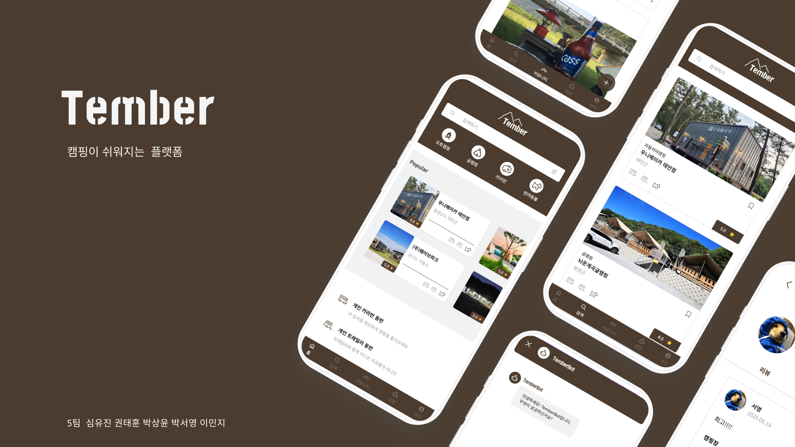

<br>

## 프로젝트 소개

- 캠핑장 정보를 쉽고 빠르게 탐색할 수 있는 웹 기반 플랫폼입니다.

- 리뷰와 커뮤니티 기능을 통해 사용자 간의 경험 공유를 지원합니다.

- '반려동물 동반 캠핑' 수요를 고려해 검색 필터와 태그에 '반려동물' 항목을 별도 제공했습니다.

- 캠핑장 상세 페이지에서 리뷰 작성 및 열람 기능을 통해 신뢰도 높은 정보 제공이 가능합니다.

- 지도 기반 마커를 통해 캠핑장의 위치 정보를 직관적으로 확인할 수 있습니다.

- 정보 탐색부터 커뮤니티 소통까지, 캠핑을 더 즐겁고 편리하게 만드는 통합 플랫폼을 지향합니다.

<br>

## 팀원 구성

|     **심유진** <br>[@youjin430](https://github.com/youjin430)     |    **권태훈**<br>[@KwonTaeHun00](https://github.com/KwonTaeHun00)    |       **박상윤**<br>[@ygvbhy](https://github.com/ygvbhy)       |      **박서영**<br>[@sduddla](https://github.com/sduddla)       |         **이민지**<br>[@mjlee38](https://github.com/mjlee38)          |
| :---------------------------------------------------------------: | :------------------------------------------------------------------: | :------------------------------------------------------------: | :-------------------------------------------------------------: | :-------------------------------------------------------------------: |
|  |  |  |  |  |

<br>

## 배포 주소

🔗 https://tember.netlify.app/

<br>

## 1. 기술 스택

| 구분             | 사용 기술                                                                                                                                                                                                                                                                                                                    |
| ---------------- | ---------------------------------------------------------------------------------------------------------------------------------------------------------------------------------------------------------------------------------------------------------------------------------------------------------------------------- |
| 프론트엔드       |                                                                                        |
| 협업 툴          |    |
| 서비스 배포 환경 |                                                                                                                                                                                                           |
| 디자인           |                                                                                                                                                                                                                     |

<br>

## 2. 폴더 구조

```
src
├── App.vue
├── assets
│   ├── fonts
│   ├── icons
│   ├── main.css
│   └── tailwind.css
├── components
│   ├── common
│   │   ├── BookmarkCard.vue
│   │   ├── BookmarkToggle.vue
│   │   ├── BottomSheet.vue
│   │   ├── BottomSheetWrapper.vue
│   │   ├── CommunityCard.vue
│   │   ├── HeaderOther.vue
│   │   ├── HeaderSearch.vue
│   │   ├── HeaderSearchMain.vue
│   │   ├── HeaderSimple.vue
│   │   ├── LoadingVue.vue
│   │   ├── NavBar.vue
│   │   └── ReviewCard.vue
│   ├── community
│   │   ├── CommentItem.vue
│   │   ├── CommentSection.vue
│   │   ├── CommunityHeader.vue
│   │   ├── CommunityHeaderOther.vue
│   │   ├── ImageUploader.vue
│   │   ├── PostCard.vue
│   │   ├── PostContent.vue
│   │   ├── PostEditor.vue
│   │   ├── SkeletonPostCard.vue
│   │   └── SkeletonPostDetail.vue
│   ├── mypage
│   │   ├── BookmarkSkeleton.vue
│   │   ├── CommunitySkeleton.vue
│   │   ├── FollowList.vue
│   │   ├── MyActivity.vue
│   │   ├── MyProfile.vue
│   │   ├── ProfileSkeleton.vue
│   │   └── ReviewSkeleton.vue
│   ├── review
│   │   ├── ReviewCreate.vue
│   │   └── ReviewEditor.vue
│   └── searchfilter
│       ├── FilterTag.vue
│       ├── locationData.js
│       └── SearchFilter.vue
├── composables
│   ├── useFetch.js
│   ├── usePostDetail.js
│   ├── usePostEditor.js
│   ├── useUserApi.js
│   └── useUserPage.js
├── directives
├── layouts
├── lib
├── main.js
├── plugins
├── router
│   └── index.js
├── stores
│   ├── campingStore.js
│   ├── communityStore.js
│   ├── followStore.js
│   ├── reviewStore.js
│   ├── theme.js
│   └── userStore.js
├── utils
│   ├── formDate.js
│   └── supabase.js
└── views
    ├── camping
    │   ├── CampingDetail.vue
    │   ├── CampingList.vue
    │   └── components
    │       ├── CampingDetailBtnGroup.vue
    │       ├── CampingDetailImageSection.vue
    │       ├── CampingDetailInfo.vue
    │       ├── CampingDetailIntro.vue
    │       ├── CampingDetailLocation.vue
    │       ├── CampingDetailNameSection.vue
    │       ├── CampingDetailReview.vue
    │       └── CampingDetailSkeleton.vue
    ├── ChatBot.vue
    ├── community
    │   ├── CommunityPostCreate.vue
    │   ├── CommunityPostDetail.vue
    │   └── CommunityPostList.vue
    ├── HomeView.vue
    ├── mypage
    │   ├── EditProfilePage.vue
    │   ├── FollowPage.vue
    │   ├── LogIn.vue
    │   └── MyPage.vue
    ├── NotFound.vue
    └── review
        └── ReviewPage.vue

```

<br>

## 3. 역할 분담

**❗️ 심유진**

- 소셜 로그인(구글) 구현
- 메인 화면 헤더 퍼블리싱/개발(검색, 아이콘 클릭 시 필터링)
- 바텀시트 애니메이션/디머 구현
- 챗봇 퍼블리싱/개발

<br>

**❗️ 권태훈**

- 메인 페이지
- 검색 필터창

<br>

**❗️ 박상윤**

이번 프로젝트에서 저는 프론트엔드와 백엔드 영역 모두에 관여하며 전반적인 웹 서비스 흐름을 이해하고 구현하는 데 중점을 두었습니다.

1. **DB 설계 및 구축**

   Supabase를 기반으로 테이블 구조를 설계하고, 캠핑장 데이터와 관련된 관계형 데이터베이스 스키마를 구축했습니다. 초기 데이터 입력, 컬럼 타입 정의, 제약 조건 설정 등을 수행하며 실제 운영 환경에 필요한 데이터 구조를 직접 구성했습니다.

2. **Edge Function을 활용한 API 설계**

   Supabase의 Edge Function을 활용해 클라이언트와 분리된 서버리스 API를 설계했습니다. 이 API는 캠핑장 목록 조회, 상세 정보 응답 등의 역할을 하며, 필터링 및 정렬 기능을 직접 구현해 사용자의 요청에 맞춘 데이터 제공이 가능하도록 했습니다.

3. **Storage 기능을 활용한 이미지 업로드 처리**

   캠핑장 이미지 등의 리소스를 Supabase Storage에 업로드하고 관리할 수 있는 로직을 구현하였습니다. 클라이언트에서 받은 이미지 파일을 스토리지에 저장하고, 해당 URL을 DB에 연동시키는 방식으로 구성했습니다.

4. **캠핑장 목록 및 상세 페이지 구현**

   직접 만든 API를 활용하여 캠핑장 리스트를 동적으로 렌더링하고, 각 캠핑장의 상세 정보를 보여주는 UI를 구성했습니다. 또한 NAVER 지도 API를 연동하여 실제 위치에 마커를 표기하는 기능을 구현해 사용자 친화적인 지도 기반 인터페이스를 제공했습니다.

5. **다크모드 기능 개발**

   Pinia를 이용해 전역 상태로 다크모드 설정을 관리하고, 사용자 설정이 페이지 전환이나 새로고침 이후에도 유지되도록 로컬스토리지를 연동하여 UX를 개선했습니다.

6. **Netlify를 활용한 배포**

   프론트엔드 애플리케이션을 Netlify에 배포하고, Supabase와의 연동을 위해 환경변수 설정, CORS 처리 등 배포 환경에 필요한 설정을 완료했습니다. 이 과정을 통해 정적 사이트 배포에 대한 이해를 확장할 수 있었습니다.

<br>

**❗️ 박서영**

- 전체 서비스 UI 디자인

- 디자인 QA 및 프로젝트 기획서 작성

- 마이페이지 구성 및 개발

  - 리뷰, 커뮤니티 게시글, 북마크 캠핑장을 탭 형태로 나눠 사용자 활동 내역을 직관적으로 확인할 수 있도록 구현
  - 사용자 프로필 조회 기능 제공
  - Skeleton UI 적용

- 프로필 편집 기능 구현

  - 닉네임 및 프로필 이미지 수정 시, 변경 사항이 사용자 정보 영역에 즉시 반영되도록 처리
  - 저장 버튼에 disabled 상태를 적용해 저장 중임을 안내하여 사용자 경험 개선

- 팔로우/팔로워 기능 구현

  - 리스트 조회 및 팔로우 상태에 따라 버튼 UI가 동적으로 반영되도록 구성
  - 맞팔 여부에 따라 '맞팔로우' 상태 처리
  - 사용자 팔로우/팔로워 페이지 간 이전 데이터가 잠깐 보이던 문제를 해결하여 UX 안정성 향상

<br>

**❗️ 이민지**

- 전체 서비스 UI 디자인
- 커뮤니티 기능 개발

  - 게시글 작성, 수정, 삭제 기능 구현
  - 카테고리 선택(일반 / 반려동물) 및 필터 적용
  - 이미지 업로드 기능 구현 (Swiper 기반 슬라이드 미리보기 제공)
  - 커뮤니티 리스트 페이지 및 게시글 상세 페이지 구성
  - 댓글 작성/삭제 기능 및 반응형 대응

- 리뷰 기능 개발

  - 캠핑장 상세 페이지 내 리뷰 작성 기능 구현 (만족도, 청결도, 한 줄 리뷰)
  - 최신 리뷰 카드 리스트 출력 및 마이페이지 연동
  - 작성 리뷰 상세 페이지 이동 처리

- UI/UX 및 기타 구현

  - 이미지 수정 시 상태 동기화 처리 (emit + watch 기반 트러블슈팅)
  - 컴포넌트 구조 분리 (usePostDetail, CommentItem, ImageUploader 등)
  - 다크모드 대응 스타일 및 반응형 UI 구성
  - Skeleton UI 적용
  - 디자인 QA 및 카드 컴포넌트 단위 레이아웃 점검

<br>

## 4. 개발 기간

- 전체 개발 기간 : 2025/5/30/금 ~ 2025/6/19/목

<br>

## 5. 페이지 별 주요 기능

### 5.1. 메인 페이지

#### 5.1.1. Header 영역

- 4개의 아이콘을 제공하며, 각 아이콘 클릭 시 해당 조건에 맞는 캠핑장 리스트를 출력합니다.
- 조건 선택을 통해 캠핑장을 필터링하며, 선택된 조건에 맞는 캠핑장 리스트를 출력합니다.
  <br>

#### 5.1.2. Popular 영역

- 사용자 리뷰 기반 평점 순으로 상위 6개의 캠핑장을 노출합니다.
- 캠핑장 카드에는 사용자 평점과 캠핑장 대표 사진을 표시합니다.
- 카드 클릭 시 캠핑장 상세 페이지로 이동합니다.

#### 5.1.3. Community 영역

- 사용자가 작성한 커뮤니티 게시글을 최신순으로 6개 노출합니다.
- 게시글 카드 클릭 시 해당 게시글 상세 페이지로 이동합니다.

#### 5.1.4. Review 영역

- 사용자 리뷰 6개를 리스트 형식으로 보여줍니다.
- 별점, 한 줄 리뷰, 작성자 정보를 함께 표시합니다.
- 리뷰 카드 클릭 시 해당 캠핑장의 상세 페이지로 이동합니다.

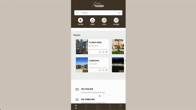


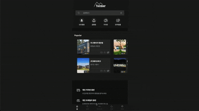

<br>

### 5.2. 검색 페이지

#### 5.2.1. 캠핑장 리스트

- 무한 스크롤을 통해 캠핑장 리스트를 계속해서 불러옵니다.

#### 5.2.2. 실시간 검색 기능

- 상단 검색창에 캠핑장명을 입력하면, 입력과 동시에 관련 캠핑장 리스트를 실시간으로 표시합니다.

#### 5.2.3. 필터 기능

- 조건 선택을 통해 캠핑장을 필터링하며, 선택된 조건에 맞는 캠핑장 리스트를 출력합니다.

#### 5.2.4. 캠핑장 카드

- 캠핑장 카드 클릭 시 해당 캠핑장의 상세 페이지로 이동합니다.
- 카드 내 북마크 아이콘 클릭 시 북마크 상태가 토글되며, 마이페이지 북마크 탭에 자동 반영됩니다.

#### 5.2.5. 캠핑장 상세 페이지

- 기본 정보, 캠핑장 소개, 위치 정보, 리뷰 섹션으로 구성되어 있으며, 탭 클릭 시 해당 섹션으로 이동합니다.
- 캠핑장에 포함된 부대시설 정보를 함께 표시합니다.
- 위치 정보는 지도 기반 마커로 시각화되어 표시됩니다.
- 로그인한 사용자는 리뷰 작성이 가능하며, 작성 즉시 하단 리뷰 리스트와 마이페이지 리뷰 탭에 반영됩니다.

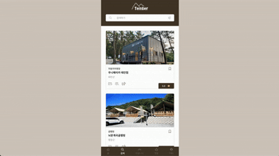
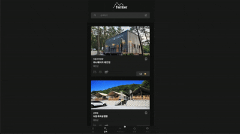

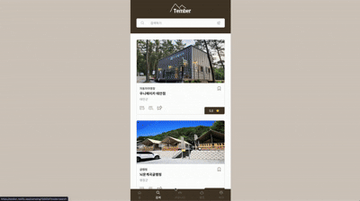
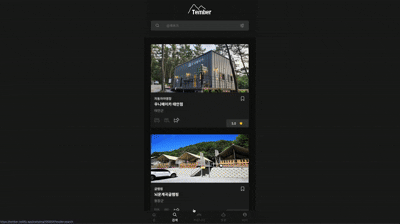

#### 5.2.6. 캠핑장 아이콘 표시

- 각 캠핑장에 해당하는 아이콘(3종)을 함께 표시합니다.
- 해당되는 아이콘만 강조되어 표시되어 직관적으로 확인할 수 있습니다.

<br>

### 5.3. 커뮤니티 페이지

#### 5.3.1. 게시글 검색

- 상단 검색창에 게시글 키워드를 입력하면, 해당 키워드가 포함된 게시글을 실시간으로 필터링하여 표시합니다.

#### 5.3.2. 정렬 및 필터 기능

- 게시글을 최신순, 인기순으로 정렬할 수 있습니다.
- 일반 태그 및 반려동물 태그를 통한 게시글 필터링이 가능합니다.

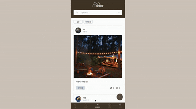
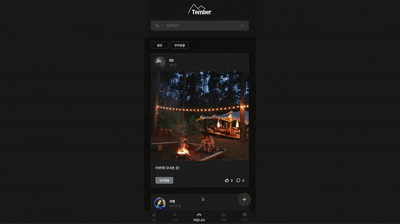

#### 5.3.3. 게시글 목록

- 게시글 리스트에서 좋아요 버튼을 직접 클릭할 수 있습니다.
- 게시글 클릭 시 해당 게시글 상세 페이지로 이동합니다.
- 작성자 프로필 클릭 시 해당 사용자의 프로필 페이지로 이동합니다.

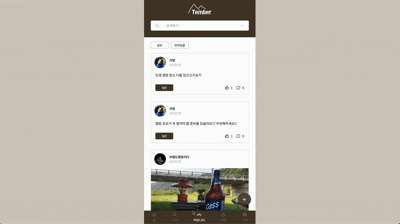
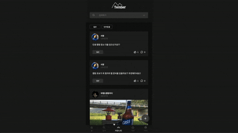

#### 5.3.4. 게시글 상세 페이지

- 좋아요 및 댓글 기능을 제공합니다. (댓글 작성, 수정, 삭제 가능)
- 게시글 작성자 본인일 경우 수정 및 삭제가 가능합니다.
- 댓글 또는 게시글 내 프로필 클릭 시 해당 사용자의 프로필 페이지로 이동합니다.


#### 5.3.5. 게시글 작성 기능

- ‘+’ 버튼 클릭 시 게시글 작성 페이지로 이동합니다.
- 사진 등록 기능을 제공하며, 최대 10장까지 업로드할 수 있습니다.
- 게시글 작성 시 일반 / 반려동물 카테고리 중 하나를 선택할 수 있습니다.
- 내용 입력 후 작성 완료 시 커뮤니티에 게시글이 업로드됩니다.

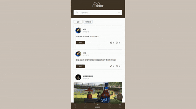
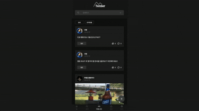

<br>

### 5.4. 마이 페이지

#### 5.4.1. 프로필 영역

- 프로필 사진, 닉네임, 팔로워 수 / 팔로잉 수를 표시합니다.
- 상단 설정 아이콘 클릭 시 프로필 수정, 다크 모드 전환, 로그아웃 기능이 표시됩니다.

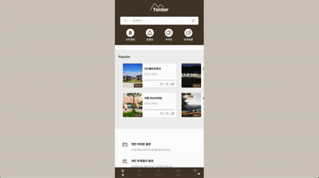


#### 5.4.2. 프로필 수정

- 프로필 사진을 변경할 수 있습니다.
- 닉네임 수정 후 저장 시 즉시 반영됩니다.

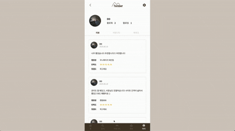
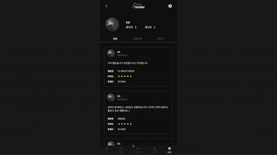

#### 5.4.3. 팔로워 / 팔로잉 리스트

- 리스트에서 팔로우 취소 및 맞팔로우가 가능합니다.
- 리스트 내 사용자 프로필 클릭 시 해당 사용자의 프로필 페이지로 이동합니다.

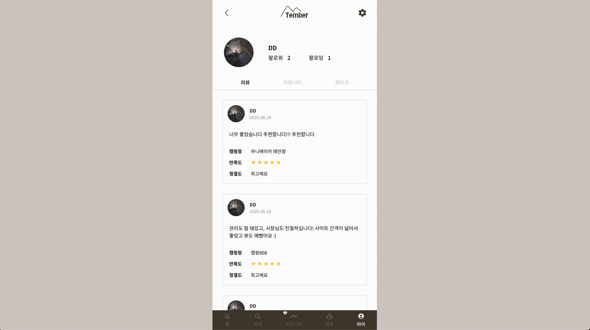
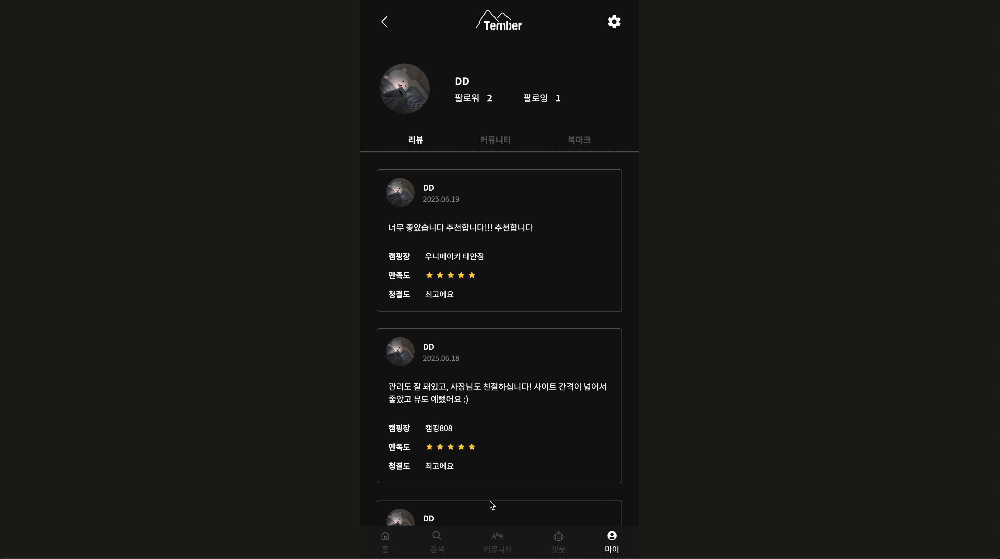

#### 5.4.4. 사용자 활동 탭

**[리뷰 탭]**

- 본인이 작성한 리뷰 목록을 확인할 수 있습니다.
- 리뷰 클릭 시 해당 캠핑장 상세 페이지로 이동하며, 리뷰 수정 및 삭제가 가능합니다.

**[커뮤니티 탭]**

- 본인이 작성한 커뮤니티 게시글 목록을 확인할 수 있습니다.
- 게시글 클릭 시 해당 게시글 상세 페이지로 이동합니다.

**[북마크 탭]**

- 사용자가 북마크한 캠핑장 카드 리스트를 확인할 수 있습니다.
- 북마크 아이콘 클릭 시 북마크를 해제할 수 있습니다.

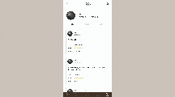


#### 5.4.5. 다크 모드

- 다크 모드 버튼 클릭 시 전체 UI가 다크 모드로 전환됩니다.

<br>

### 5.5. 챗봇

- 웹사이트 내에서 캠핑 관련 궁금한 점을 실시간으로 질문할 수 있는 챗봇 기능을 제공합니다.
- 사용자는 캠핑장 추천, 반려동물 동반 여부, 리뷰 확인 등 다양한 질문을 챗봇을 통해 해결할 수 있습니다.

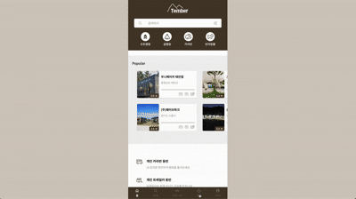
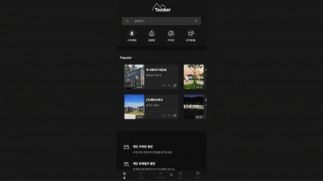

<br>

## 6. 트러블 슈팅

**❗️ 심유진**

[문제 상황] <br>
OpenAI API를 활용해 사용자의 메시지를 전달하고 그에 대한 챗봇의 응답을 출력하는 기능을 구현하던 중 사용자가 입력한 메시지는 화면에 잘 출력되었지만 챗봇의 응답이 화면에 전혀 나타나지 않는 현상이 발생했음
초기에는 API 호출 자체에 문제가 있다고 생각했지만, 네트워크 요청 자체는 정상적으로 완료되고 있었기 때문에 문제의 원인을 더 깊이 분석했음

[원인 분석] <br>
API 요청은 정상적으로 이루어졌고 응답 또한 정상적으로 수신되고 있었음 그런데 콘솔을 통해 응답 객체를 살펴본 결과 응답에서 챗봇의 메시지를 꺼내오는 방식이 잘못되어 있었음을 발견함 <br>

하지만 실제 OpenAI의 API 응답 구조는 아래와 같았음

```json
{
  "choices": [
    {
      "message": {
        "role": "assistant",
        "content": "안녕하세요, 무엇을 도와드릴까요?"
      }
    }
  ]
}
```

원하는 응답 텍스트는 data.choices[0].message.content에 존재하고 있었는데 이를 정확히 파악하지 못한 채 단순히 choices[]만 접근하고 있었던 것이 응답이 화면에 표시되지 않는 원인이었음

[해결 방법] <br>
콘솔을 통해 API의 응답 전체 구조를 직접 출력하고 data.choices[0].message.content로 정확히 접근 경로를 수정함으로써 정상적으로 챗봇의 응답이 출력되도록 문제를 해결함

[배운 점] <br>
이번 경험을 통해 API 문서를 읽는 것만으로는 부족하고 실제로 응답 구조를 콘솔로 확인해보는 디버깅 과정이 얼마나 중요한지를 체감했다.
단순한 코드 실수처럼 보일 수 있지만 이런 작은 오해 하나가 전체 기능을 막을 수 있다는 점에서 정확한 데이터 구조 파악의 중요성을 다시 한번 느꼈다.
또한 에러가 나지 않아도 기능이 동작하지 않는 경우엔 데이터 흐름을 꼼꼼히 따라가며 점검해야 한다는 걸 배우는 좋은 기회였다.

<br>

**❗️ 권태훈**

홈 화면의 Popular 섹션에서 평점이 높은 캠핑장들을 불러올 때 Swiper의 카드 레이아웃이 깨지는 현상이 발생했습니다. <br>
원인으로는 Supabase에서 이미지 데이터를 불러올 때 이미지 로드가 완료되기 전에 Swiper가 렌더링을 시작해 계산을 먼저 끝내버려 레이아웃이 비정상적으로 정렬되고 있었습니다. <br>
그래서 FT님과 강사님이 이미지 로딩 이후 Swiper가 렌더링을 시작하게 해보는 것이 어떻냐 라는 피드백을 통해 이미지를 전부 다운로드 받은 후에 렌더링이 되는 로직을 추가하여 이를 통해 문제를 해결하였습니다.

<br>

**❗️ 박상윤**

공공기관에서 제공하는 Open API 데이터를 Supabase의 DB로 직접 이관하고자 했으나, 여러 가지 제약으로 인해 **Edge Function 내에서 API 호출이 정상적으로 수행되지 않는 문제가 발생**했습니다. 주요 원인은 다음과 같습니다:

- **CORS 정책 문제**: 공공 Open API 서버에서 CORS 설정이 되어 있지 않아 Edge Function에서의 직접 호출이 차단됨
- **HTTP 라이브러리 제한**: Supabase의 Edge Function이 Deno 런타임을 기반으로 하다 보니, 일부 라이브러리에서 HTTP 요청 기능이 제한적이거나 호환성 문제가 발생함
- **User-Agent 차단**: Deno의 기본 User-Agent를 공공 API 서버 측에서 차단했을 가능성이 있음

이 문제를 해결하기 위해, **Express 기반의 별도 프록시 서버를 구축**하여 데이터를 중간에서 수집하고 가공한 후 Supabase로 전송하는 방식으로 구조를 변경했습니다. 이 과정에서 백엔드와 데이터 흐름에 대한 깊은 이해가 필요했고, 실제 API 환경에서 발생할 수 있는 제약사항에 대응하는 경험을 쌓을 수 있었습니다.

<br>

**❗️ 박서영**

팔로워/팔로잉 기능을 구현하는 과정에서, 다른 사용자의 팔로워/팔로잉 페이지로 이동할 때 이전 페이지의 리스트가 잠깐 보였다가 새로운 데이터로 바뀌는 잔상 현상이 있었습니다. 이는 이전 페이지의 상태가 초기화되지 않아, 새로운 데이터를 받아오기 전에 기존 값이 먼저 렌더링된 것이 원인이었습니다.
해결을 위해 onBeforeMount 훅을 활용하여 페이지 진입 시 followers, followings, otherUser 상태를 초기화하고, 잔상이 보이지 않도록 수정하였습니다.

또한, 팔로워 또는 팔로잉이 없는 경우 보여주는 안내 문구가, 데이터를 받아오는 로딩 중에도 노출되는 문제가 있었습니다. 이는 로딩이 완료 되기 전 리스트가 비어있다고 잘못 판단해, 안내 문구가 먼저 렌더링된 것이 원인이었습니다.
이를 해결하기 위해 isLoading 상태를 추가하고, 로딩이 끝난 후이고, 팔로워/팔로잉 탭이 선택된 상태이며, 리스트가 비어있을 때만 안내문구가 보이도록 조건을 수정하였습니다.

<br>

## 7. 프로젝트 후기

**❗️ 심유진**

이번 프로젝트는 ... 솔직히 나에게 많은 생각을 남긴 경험이었다.
솔직히 말하자면 프로젝트 초반에는 집중력이 부족하고 역할 수행에 충분히 적극적이지 못했던 부분이 있었다. 다른 팀원들에게 더 많이 의지했던 점이 마음에 걸렸고 그만큼 내 몫을 충분히 다하지 못한 것 같아 아쉬움이 남는다.
그래도 프로젝트가 진행되면서 조금이나마 뷰와 수파베이스에 대한 이해도가 생겼고, 챗봇 기능이 있는 걸 보면 되게 어려운 것이라고 생각했고 어떻게 시작하는건지 막막했었는데 막상 해보니 비동기통신을 통해 생각보다 쉽게 기능을 구현할 수 있다는 점을 알게 되었다. 그리고 다음부턴 코드를 짜기 전에 전체적인 흐름을 알고 코드를 짜야겠다는 생각이 들었다.
이러나저러나 이 경험을 통해 "다음엔 더 주도적으로 움직여보고 싶다"는 다짐을 하게 되었고, 실제 개발 역량을 키우는 것뿐만 아니라 팀 안에서의 소통과 태도도 중요하다는 걸 다시 한번 깨달았다. 아쉬움이 있었던 만큼, 더 성장하고 싶은 마음이 커졌다.

<br>

**❗️ 권태훈**

이번 프로젝트는 메인 페이지와 검색 필터링 구현을 중심으로 많은 고민과 학습을 할 수 있었고, 저의 부족한 부분도 돌아볼 수 있는 좋은 시간이었습니다. 그 부분에 대해서는 앞으로 더 공부해야겠다는 생각이 들었습니다. 또한 이번에 발생한 트러블 슈팅을 해결하는 과정에서 새롭게 알게 된 방법들도 있어 이 또한 공부해보며 한층 더 성장해볼려고 합니다. 약 3주 간 함께 고생한 팀원 분들 모두 정말 수고 많으셨습니다.

<br>

**❗️ 박상윤**

이번 프로젝트에서는 프론트엔드뿐 아니라 백엔드 역할 일부까지 직접 경험해보며 웹 서비스의 흐름을 전체적으로 이해할 수 있는 기회가 되었습니다.

Supabase를 사용해 DB 설계 및 초기 데이터 구축, 그리고 Edge Function을 활용한 별도 API 설계를 담당했습니다. 서버리스 환경에서의 API 작성은 처음이었지만, 실제 데이터를 다루고 필터링, 정렬 등의 기능을 직접 구현하면서 백엔드 로직에 대한 이해도가 높아졌습니다. 다만, Supabase의 권한 처리나 보안 관련 개념(RLS 등)은 아직 익숙하지 않아, 추후 학습이 필요하다고 느꼈습니다.

프론트엔드 영역에서는 캠핑장 목록과 상세 페이지 구성, 다크모드 로직 구현, Netlify를 통한 최종 배포까지 진행했습니다. React 상태 관리를 활용한 다크모드 전환과, 검색/필터링 결과가 자연스럽게 연결되도록 컴포넌트 구조를 고민하며 작업했습니다. 또한 배포 시에는 환경변수 관리, CORS 처리 등 실제 서비스 운영에 가까운 과정을 겪어볼 수 있었습니다.

이번 프로젝트를 통해 기술 스택뿐 아니라 서비스 흐름을 설계하고 구현하는 전반적인 경험을 할 수 있었고, 부족한 부분은 명확히 파악해볼 수 있는 시간이었습니다. 향후에는 보안이나 성능 최적화, 구조적인 코드 설계까지도 고려하는 개발자로 성장하고 싶습니다.

<br>

**❗️ 박서영**

이번 프로젝트를 통해 코드 로직에 대한 이해도가 이전보다 훨씬 높아졌고, 특히 팔로우/팔로워, 마이페이지, 프로필 수정 기능을 직접 구현하면서 많은 것을 배울 수 있었습니다. 처음 접한 Supabase는 다소 낯설고 어려웠지만, 프로젝트를 진행하면서 점차 개념에 익숙해지고, 활용법에 대한 이해도도 함께 높아졌습니다.
다만, 컴포넌트 분리나 코드 리팩토링 등의 부분에서는 아직 미숙함을 느꼈고, 이러한 부족함은 앞으로 작은 프로젝트들을 꾸준히 진행하며 보완해나갈 계획입니다.
이번 경험을 통해 현재 제 실력을 객관적으로 돌아볼 수 있었고, 앞으로 어떤 부분을 중점적으로 학습하고 성장시켜야 할지 명확하게 알 수 있었습니다.

<br>

**❗️ 이민지**

Vue.js로 진행한 첫 프로젝트였고, Supabase 역시 처음 사용해보는 DB라 쉽지 않은 시작이었지만, 새로운 프레임워크와 데이터베이스를 직접 다뤄보며 많은 것을 학습할 수 있었고, 그 과정을 돌아보면 스스로도 많이 성장했다는 점에서 뿌듯함을 느꼈습니다.
특히 Supabase의 Edge Function을 처음으로 활용하여 데이터를 처리하는 방식에 대해 새롭게 배울 수 있었고, 프로젝트 중반에는 코드 리팩토링 과정에서 어려움을 겪기도 했지만, 커스텀 훅과 컴포넌트 단위로 코드를 분리하면서 역할 분리, 가독성 좋은 코드 작성의 중요성과 코드 재사용성 향상에 대해 배울 수 있어 전반적으로 많은 깨달음을 얻었습니다.
그러나 아직 로직적인 사고나 데이터베이스 이론에 있어 부족한 점이 많다고 느꼈고, 더 깊이 공부할 필요성을 절실히 깨달았습니다. 디자인부터 기능 개발, 그리고 마지막 QA 단계까지 전반적인 업무를 맡으며 프로젝트에 책임감을 가지게 되었고, 부족하지만 팀원들의 도움 덕분에 끝까지 잘 마무리할 수 있었던 것 같습니다. 이런 경험을 바탕으로 새로운 기술을 두려워하지 않고, 끊임없이 배우며 성장하는 개발자가 되고 싶습니다.
